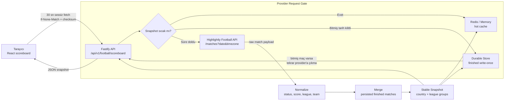
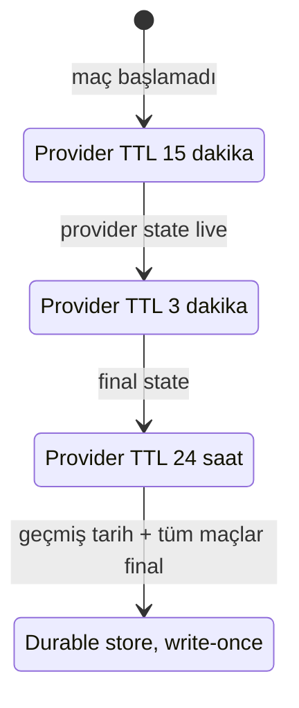

# ScoreXP Veri Akışı

Bu modelde tarayıcı Highlightly API'ye asla doğrudan gitmez. Bütün dış istekleri backend kontrol eder; frontend yalnızca stabil, normalize edilmiş scoreboard snapshot'ı okur.

## Yenileme Politikası

## Akış İlkeleri

- Canlı maç varsa provider tarafı en erken 3 dakikada bir yenilenir.
- Başlamamış maçlar için provider tarafı 15 dakika TTL ile korunur.
- Geçmiş ve tamamı bitmiş günler durable store'a kilitlenir; aynı gün için provider'a tekrar gidilmez.
- Frontend kendi sayfasını yenilemez; sadece data alanı sessiz şekilde checksum değişirse güncellenir.
- API anahtarı sadece backend environment değişkeninde bulunur.
